# HomeSync

A self-hosted household management platform for two. Runs on a Raspberry Pi. Tracks credit card benefits, chores, movies, workouts, lawn care, car maintenance, and cat care in one place.

Built with React + Vite (PWA), Node.js / Express, PostgreSQL, and Python worker processes. Works offline — changes sync automatically when you're back on the home network.

## Modules

| Module | What it tracks |
|---|---|
| **Credit Card Benefits** | Cards, benefits, usage, reset cycles, expiry alerts |
| **Chores** | Recurring tasks, assignments, completion history, weather flags |
| **Movies** | Shared watchlist, ratings, platform tags, watched status |
| **Workouts** | Sessions, sets, reps, RPE, PRs, routines, deload logic, progress photos |
| **Lawn Care** | Mowing logs, fertilizing, herbicide, weather-based mow windows, lawn photos |
| **Car Maintenance** | Vehicles, mileage-based tasks, service logs, maintenance schedule ingestion |
| **Cat Care** | Two cats — meds, vet visits, weight tracking, recurring care schedules, photos |

## Stack

**Frontend**
- React (TypeScript) + Vite
- PWA via `vite-plugin-pwa` (Workbox) — offline-capable, installable on mobile
- React Router v6
- shadcn/ui or MUI
- Recharts
- IndexedDB (`idb`) for offline write queue

**Backend**
- Node.js / Express (TypeScript)
- PostgreSQL 16 (Knex.js migrations and query builder)
- JWT authentication (jsonwebtoken + bcrypt)
- Nginx reverse proxy

**Workers**
- Node.js workers (pg-boss): benefit expiry checks, weather polling, maintenance scheduling, cat care alerts
- Python workers (systemd): document parsing (`pypdf`, `pdfplumber`, `python-docx`) and lawn mow window advisor (`requests`, `psycopg2`)

**Infrastructure**
- Raspberry Pi 4 (self-hosted, always-on)
- Local filesystem for photo and document storage
- Tailscale for optional remote access

## Architecture

```
Browser (React PWA)
    │
    ▼
Nginx (Pi)
    │
    ▼
Express API ──► PostgreSQL
    │               │
    │           parse_jobs table
    │               │
    ├──► Node workers (systemd)
    │       - benefit expiry
    │       - weather polling
    │       - maintenance scheduler
    │       - cat care alerts
    │
    └──► Python workers (systemd)
            - document parser
            - lawn advisor
```

Workers communicate with the API exclusively through PostgreSQL. No inter-process messaging required.

### Offline Sync

When away from the home network, write operations (POST, PUT, PATCH, DELETE) are queued in IndexedDB. On reconnect, the sync engine replays them in order against the live API. Conflicts are resolved last-write-wins; edge cases are flagged for manual review.

Sync status is visible in the app header: `Synced` · `Pending N changes` · `Offline`

## Key Features

### Document Ingestion

Upload a PDF or Word doc to any module. The Python parser extracts structured data and creates records automatically.

| Document | Module | What gets created |
|---|---|---|
| Maintenance schedule PDF | Car | `maintenance_tasks` rows with mileage/time intervals |
| Credit card benefit guide | Credit Card | `card_benefits` rows with reset cycles |
| Workout plan | Workout | `exercise_sets` template rows |
| Vet discharge summary | Cat Care | `cat_vet_visits` row with findings and follow-up date |
| Lawn product label | Lawn | `lawn_treatment_logs` row with product and amount |

Extraction uses the Anthropic API. Falls back to rule-based extraction if the Pi is offline; job is flagged for review.

### Weather-Aware Scheduling

Outdoor chores are cross-referenced against a 10-day forecast (Open-Meteo, free tier). Adverse conditions — rain > 50%, wind > 25 mph, temp below 20°F or above 100°F — trigger an in-app alert.

### Mow Window Advisor

The Python lawn advisor runs daily. It applies your preferred temp and humidity ranges, a configurable post-rain exclusion window, and the 1/3 mowing rule to suggest up to three mow dates in the next 10 days, with a recommended cut height.

### Workout Deload Logic

Consecutive training weeks are tracked per routine. After a configurable cycle length (default 5 weeks), the system flags the next session as a deload: volume drops 50% for 3 days, then weight drops 50% for the rest of the week.

### PR Detection

A set is automatically flagged as a PR when it exceeds the user's previous best for that exercise.

### Cat Care Scheduler

Recurring care items (vaccines, flea/tick, supplements, dental) are tracked per cat with configurable intervals. The scheduler surfaces items due within 7 days and flags overdue medication doses.

## API

All endpoints are under `/api/v1/` and require `Authorization: Bearer <token>` except auth routes.

Response envelope:
```json
{
  "success": true,
  "data": {},
  "errors": [],
  "meta": { "page": 1, "page_size": 20, "total_count": 42 }
}
```

Core route groups: `modules`, `chores`, `cards/benefits`, `movies`, `workouts`, `lawn`, `vehicles/maintenance`, `cats`, `documents`, `photos`, `weather`, `sync`, `auth`

## Database

PostgreSQL 16. Migrations via Knex.js.

Core tables: `users`, `modules`, `chores`, `chore_completion_history`, `progress_photos`, `documents`, `parse_jobs`, `weather_events`, `sync_queue`

Module tables: `credit_cards`, `card_benefits`, `benefit_usage_logs`, `movie_entries`, `workout_routines`, `workout_logs`, `exercise_sets`, `lawn_config`, `lawn_treatment_logs`, `mow_window_recommendations`, `vehicles`, `maintenance_tasks`, `maintenance_logs`, `cats`, `cat_weight_logs`, `cat_med_logs`, `cat_vet_visits`, `cat_care_schedules`

Here's the raw Mermaid ERD code:

```mermaid
erDiagram
  users {
    uuid id PK
    text email
    text password_hash
    text display_name
    text role
    timestamptz created_at
    timestamptz last_login_at
  }
  modules {
    uuid id PK
    text name
    text module_type
    text description
    uuid owner_id FK
    boolean weather_sensitive
    text zipcode
    timestamptz created_at
  }
  chores {
    uuid id PK
    uuid module_id FK
    text title
    text description
    uuid assigned_to FK
    date due_date
    text recurrence_pattern
    timestamptz last_completed_at
    text status
    boolean is_weather_dependent
    text notes
  }
  chore_completion_history {
    uuid id PK
    uuid chore_id FK
    uuid completed_by FK
    timestamptz completed_at
    text notes
  }
  progress_photos {
    uuid id PK
    uuid module_id FK
    uuid entity_id
    text entity_type
    text file_path
    text caption
    timestamptz taken_at
    uuid uploaded_by FK
  }
  documents {
    uuid id PK
    uuid module_id FK
    text file_name
    text file_path
    text document_type
    jsonb parsed_content
    text parse_status
    timestamptz uploaded_at
  }
  parse_jobs {
    uuid id PK
    uuid document_id FK
    text status
    timestamptz queued_at
    timestamptz started_at
    timestamptz completed_at
    text error
    int retry_count
  }
  weather_events {
    uuid id PK
    uuid module_id FK
    date forecast_date
    text condition
    text severity
    uuid[] chores_affected
    timestamptz alert_sent_at
  }
  sync_queue {
    uuid id PK
    uuid user_id FK
    text method
    text endpoint
    jsonb payload
    timestamptz queued_at
    timestamptz synced_at
    boolean conflict_flagged
  }
  credit_cards {
    uuid id PK
    uuid module_id FK
    text card_name
    text issuer
    text last_four
    numeric annual_fee
    date renewal_date
  }
  card_benefits {
    uuid id PK
    uuid card_id FK
    text benefit_name
    numeric benefit_value
    text reset_cycle
    int reset_day
    date expires_at
    text notes
  }
  benefit_usage_logs {
    uuid id PK
    uuid benefit_id FK
    uuid used_by FK
    numeric amount_used
    timestamptz used_at
    text notes
  }
  movie_entries {
    uuid id PK
    uuid module_id FK
    text title
    int year
    text platform
    uuid added_by FK
    text watched_status
    timestamptz watched_at
    numeric rating
    boolean is_favorite
    text notes
  }
  workout_routines {
    uuid id PK
    uuid module_id FK
    text name
    int deload_cycle_weeks
    text notes
  }
  workout_logs {
    uuid id PK
    uuid module_id FK
    uuid routine_id FK
    uuid logged_by FK
    date session_date
    boolean is_deload_session
    text notes
  }
  exercise_sets {
    uuid id PK
    uuid workout_log_id FK
    text exercise_name
    int set_number
    int reps
    numeric weight_lbs
    numeric rpe
    boolean is_pr
  }
  lawn_config {
    uuid id PK
    uuid module_id FK
    text grass_type
    numeric target_mow_height_in
    numeric growth_rate_in_per_day
    int pref_min_temp_f
    int pref_max_temp_f
    int pref_min_humidity
    int pref_max_humidity
    int rain_exclusion_days
    int square_footage
  }
  lawn_treatment_logs {
    uuid id PK
    uuid module_id FK
    text treatment_type
    uuid treated_by FK
    date treatment_date
    numeric cut_height_in
    text product_name
    numeric product_amount_oz
    text notes
  }
  mow_window_recommendations {
    uuid id PK
    uuid module_id FK
    timestamptz generated_at
    date[] suggested_dates
    numeric estimated_height_in
    numeric recommended_cut_height_in
    timestamptz alert_sent_at
  }
  vehicles {
    uuid id PK
    uuid module_id FK
    int year
    text make
    text model
    text trim
    text vin
    int current_mileage
    timestamptz last_mileage_updated_at
  }
  maintenance_tasks {
    uuid id PK
    uuid vehicle_id FK
    text task_name
    int interval_miles
    int interval_days
    timestamptz last_completed_at
    int last_completed_mileage
    date next_due_date
    int next_due_mileage
    text status
    text notes
  }
  maintenance_logs {
    uuid id PK
    uuid maintenance_task_id FK
    uuid completed_by FK
    timestamptz serviced_at
    int mileage_at_service
    text service_provider
    numeric cost_usd
    text notes
  }
  cats {
    uuid id PK
    uuid module_id FK
    text name
    text breed
    date date_of_birth
    text notes
  }
  cat_weight_logs {
    uuid id PK
    uuid cat_id FK
    numeric weight_lbs
    timestamptz logged_at
    text notes
  }
  cat_med_logs {
    uuid id PK
    uuid cat_id FK
    text med_name
    text dose
    int frequency_days
    date start_date
    date end_date
    timestamptz last_given_at
    timestamptz next_due_at
    text notes
  }
  cat_vet_visits {
    uuid id PK
    uuid cat_id FK
    date visit_date
    text clinic_name
    text vet_name
    text reason
    text findings
    date next_visit_date
    numeric cost_usd
  }
  cat_care_schedules {
    uuid id PK
    uuid cat_id FK
    text item_name
    int interval_days
    timestamptz last_completed_at
    date next_due_date
    text notes
  }

  users ||--o{ modules : owns
  users ||--o{ chores : assigned_to
  users ||--o{ chore_completion_history : completed_by
  users ||--o{ progress_photos : uploaded_by
  users ||--o{ sync_queue : queues
  users ||--o{ benefit_usage_logs : used_by
  users ||--o{ movie_entries : added_by
  users ||--o{ workout_logs : logged_by
  users ||--o{ lawn_treatment_logs : treated_by
  users ||--o{ maintenance_logs : completed_by

  modules ||--o{ chores : contains
  modules ||--o{ progress_photos : has
  modules ||--o{ documents : stores
  modules ||--o{ weather_events : receives
  modules ||--o{ credit_cards : has
  modules ||--o{ movie_entries : has
  modules ||--o{ workout_routines : has
  modules ||--o{ workout_logs : has
  modules ||--o| lawn_config : configures
  modules ||--o{ lawn_treatment_logs : records
  modules ||--o{ mow_window_recommendations : generates
  modules ||--o{ vehicles : tracks
  modules ||--o{ cats : contains

  chores ||--o{ chore_completion_history : logs

  documents ||--o| parse_jobs : queues

  credit_cards ||--o{ card_benefits : defines
  card_benefits ||--o{ benefit_usage_logs : tracks

  workout_routines ||--o{ workout_logs : guides
  workout_logs ||--o{ exercise_sets : contains

  vehicles ||--o{ maintenance_tasks : schedules
  maintenance_tasks ||--o{ maintenance_logs : records

  cats ||--o{ cat_weight_logs : tracks
  cats ||--o{ cat_med_logs : tracks
  cats ||--o{ cat_vet_visits : records
  cats ||--o{ cat_care_schedules : follows
```



## Pi Setup

**Requirements**
- Raspberry Pi 4 (4GB+ RAM)
- Raspberry Pi OS Lite 64-bit
- PostgreSQL 16
- Node.js 20 LTS (via nvm)
- Python 3.11+
- Nginx
- Tailscale (optional, for remote access)

**Recommended hardware**
- USB 3.0 SSD (256GB+) for boot and storage — more durable than SD under constant DB writes
- Official 5V 3A USB-C power supply
- Case with passive cooling or fan

**Backup**
Daily `pg_dump` to an external drive or NAS, retained 30 days. Configured via systemd timer.

## Deployment

All processes are managed by systemd:

| Service | Description |
|---|---|
| `homesync-api` | Node.js / Express API |
| `homesync-parser` | Python document parser worker |
| `homesync-lawn-advisor` | Python lawn advisor (daily timer) |
| `homesync-workers` | Node.js workers (benefits, weather, maintenance, cat care) |
| `postgresql` | Database |
| `nginx` | Reverse proxy |

Logs: `/var/log/homesync/`

## Development

```bash
# Clone
git clone https://github.com/keenanmacneill/homesync
cd homesync

# Install dependencies
npm install

# Set up environment
cp .env.example .env
# Edit .env: DATABASE_URL, JWT_SECRET, ANTHROPIC_API_KEY

# Run migrations
npm run db:migrate

# Seed development data
npm run db:seed

# Start API (dev)
npm run dev:api

# Start frontend (dev)
npm run dev:client

# Python workers (dev)
cd workers
python -m venv venv && source venv/bin/activate
pip install -r requirements.txt
python parser_worker.py
python lawn_advisor.py
```

## Project Status

Currently in development. Planned modules are implemented in this order:

- [ ] Auth + module shell
- [ ] Chores
- [ ] Credit Card Benefits
- [ ] Movies
- [ ] Workouts
- [ ] Lawn Care + Python lawn advisor
- [ ] Car Maintenance + Python document parser
- [ ] Cat Care
- [ ] Offline sync (PWA + IndexedDB)
- [ ] Document ingestion pipeline

## License

Private. Personal use only.
